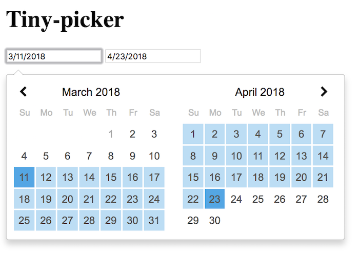

# tiny-picker

*Ultra light weight date picker. There are no external dependencies involved. We mimic jQuery UI Datepicker without the bloat*<br><br>
View Demo here<br><br>

## Install

` npm install tiny-picker --save`

## Use

Bind to input:

```html
<input type="text" id="startDate" />
<input type="text" id="endDate" />
```
To have preselected dates:
```html
    <input type="text" class="TinyPicker" id="startDate" value="2018-10-22">
    <input type="text" class="TinyPicker" value="2018-11-04">
```
In Javascript:<br>
```js
new TinyPicker({
        firstBox:document.getElementById('startDate'),
        lastBox: document.getElementById('endDate'),
}).init();
```

#### Options:
*TinyPicker also takes in options as seen below*
```js
new TinyPicker({
            firstBox:document.getElementById('startDate'), // Required -- Overrides us finding the first input box
            lastBox: document.getElementById('endDate'), // Required -- Overrides us finding the last input box
            monthsToShow: 2, // How many months to display
            days: ['Su','Mo','Tu','We','Th','Fr','Sa'], // Override for day abbreviations in the calendar
            local: 'es-US', // Specifiy the language and date format. < IE 10 defaults to en-US
        });
```

#### Color/Style Customizations

Currently using standard jQuery colorizations. Just create overriding styles in your own CSS files to change. Classes are currently not specific so overriding should be a breeze!

## Benchmarking Size (`npm package-size`):
|Date Range Packages  | minified  |  Gzipped |
| ------------- | ------------- | ------------- |
| tiny-picker  | 3.31kB |1.43kB
| Pikaday  |247kB|70.6kB|
| jquery-date-range-picker |367kB|110kB|
| moment  |232kB|65.1kB|
| air-datepicker  |35.3kB|9.45kB|
| tiny-date-picker  |9.8kB|3.42kB|

## Developing and contributing to tiny-picker
### Folder structure
The main body of code is in `index.js`

The tests are in the `test/spec` directory. Please follow naming convention with `xxxx.spec.js`

### Running tests - TODO

We use [Feather-test](https://www.npmjs.com/package/feather-test) which is similar to jasmine for unit tests. Unless there is a very compelling reason to use something different, please continue using Feather for tests. The existing tests are in the spec folder. Here are some useful command shortcuts:

#### Run all the tests:

`npm test`

#### Run only some tests:

`npm test --run=nameOfFile`

### Before submitting a pull request

Please make sure all code supports all versions of node. We write code in ES5 syntax for smaller size and browser compatibility.

We use ESLint for syntax consistency, and the linting rules are included in this repository. Running `npm test` will check the linting rules as well. Please make sure your code has no linting errors before submitting a pull request.

`npm run lint_fix` will also automatically fix any linting errors.

## License

[MIT](https://github.com/raymondborkowski/4loop/blob/master/LICENSE)
